<div align="center">


<br/>

[](https://metaventionsai.com)
[](https://github.com/Dicoangelo/The-Decosystem)
[]()

<br/>

[]()
[]()
[]()
[]()

<br/>

*A bidirectional co-evolution system where Claude analyzes its own usage patterns and modifies its own instructions.*

**The invention hidden in your vision.**

</div>


<br/>

## The Unlock

<div align="center">

```
┌────────────────────────────────────────────────────────────────────────────────┐
│                                                                                │
│   BEFORE                              ◆                              AFTER     │
│   ══════                                                             ═════     │
│                                                                                │
│   Human → AI → Output                              Human ↔ AI                  │
│       ↓                                                ↕                       │
│   (context lost)                                   (evolving)                  │
│                                                        ↕                       │
│   Next session:                                    ←───┘                       │
│   starts from zero                                 Feedback closes             │
│                                                                                │
│   ══════════════════════════════════════════════════════════════════════════   │
│                                                                                │
│   "Most AI systems are unidirectional. The loop is open."                      │
│   "What if the AI could read its own patterns? Modify its own instructions?"   │
│   "Let the human-AI pair co-evolve?"                                          │
│                                                                                │
└────────────────────────────────────────────────────────────────────────────────┘
```

</div>

<br/>


<br/>

## System Architecture

```mermaid
%%{init: {'theme': 'dark', 'themeVariables': { 'primaryColor': '#00d9ff', 'primaryTextColor': '#fff', 'primaryBorderColor': '#00d9ff', 'lineColor': '#00d9ff', 'secondaryColor': '#1a1a2e', 'tertiaryColor': '#0d1117', 'clusterBkg': '#0d1117', 'clusterBorder': '#00d9ff'}}}%%
flowchart TB
    subgraph METAVENGINE["⚙️ META-VENGINE ⚙️"]
        direction TB

        subgraph INTERACTION["🔄 INTERACTION LAYER"]
            QUERY["Query → Claude → Response"]
        end

        subgraph DATA["💾 DATA LAYER"]
            direction LR
            STATS["stats-cache\n━━━━━━━━━━\n27K messages\n104 sessions"]
            DQ["dq-scores\n━━━━━━━━━━\nDecision Quality\nHistory"]
            PATTERNS["patterns\n━━━━━━━━━━\n8 Session Types\nDetection"]
            IDENTITY["identity\n━━━━━━━━━━\nExpertise\nEvolution"]
        end

        subgraph ANALYSIS["🧠 ANALYSIS LAYER"]
            META["Meta-Analyzer\n━━━━━━━━━━\nAggregate • Analyze\nPropose • Apply"]
        end

        subgraph MODIFICATION["⚡ MODIFICATION LAYER"]
            direction LR
            CLAUDE_MD["CLAUDE.md\n━━━━━━━━━━\nLearned Patterns\nAuto-Generated"]
            PREFETCH["Prefetcher\n━━━━━━━━━━\nPattern-Aware\nContext Loading"]
        end

        subgraph EVOLUTION["🔮 EVOLUTION LAYER"]
            NEXT["Next Session\nStarts Better"]
        end
    end

    HUMAN(("👤 HUMAN\nOPERATOR"))

    HUMAN <==>|"Interact"| QUERY
    QUERY -->|"Telemetry"| STATS
    QUERY -->|"Telemetry"| DQ
    QUERY -->|"Telemetry"| PATTERNS
    STATS --> META
    DQ --> META
    PATTERNS --> META
    IDENTITY --> META
    META -->|"Modifications"| CLAUDE_MD
    META -->|"Modifications"| PREFETCH
    CLAUDE_MD --> NEXT
    PREFETCH --> NEXT
    NEXT -.->|"Feedback Loop"| QUERY

    style METAVENGINE fill:#0d1117,stroke:#00d9ff,stroke-width:3px
    style INTERACTION fill:#1a1a2e,stroke:#00d9ff,stroke-width:2px
    style DATA fill:#1a1a2e,stroke:#9945ff,stroke-width:2px
    style ANALYSIS fill:#1a1a2e,stroke:#ffd700,stroke-width:2px
    style MODIFICATION fill:#1a1a2e,stroke:#00ff88,stroke-width:2px
    style EVOLUTION fill:#16213e,stroke:#00d9ff,stroke-width:2px
    style HUMAN fill:#00d9ff,stroke:#fff,stroke-width:2px,color:#0d1117
```

<div align="center">



<sub>🔄 <i>The Closed Loop — Telemetry flows up, modifications flow down, the flywheel spins</i></sub>

</div>

<br/>


<br/>

## Core Components

<div align="center">
<table>
<tr>
<td width="50%" align="center">

<h3>🧠 Meta-Analyzer</h3>
<b>The Self-Awareness Engine</b>
<br/><br/>
<p>Aggregates telemetry from 6 data sources. Analyzes patterns. Generates modification proposals. Applies with human approval. Evaluates effectiveness.</p>
<br/>

`Python` `Telemetry` `Analysis`

<br/>

</td>
<td width="50%" align="center">

<h3>🔍 Pattern Detector</h3>
<b>Session Type Recognition</b>
<br/><br/>
<p>Identifies 8 session patterns (debugging, research, architecture...). Predicts context needs. Feeds patterns to co-evolution loop.</p>
<br/>

`JavaScript` `Detection` `Prediction`

<br/>

</td>
</tr>
<tr>
<td width="50%" align="center">

<h3>📡 Prefetcher</h3>
<b>Proactive Context Loading</b>
<br/><br/>
<p>Pattern-aware context injection. Temporal prediction based on usage habits. Loads research papers, learnings, and tools before you ask.</p>
<br/>

`Python` `Context` `Prediction`

<br/>

</td>
<td width="50%" align="center">

<h3>📊 DQ Scorer</h3>
<b>Decision Quality Routing</b>
<br/><br/>
<p>Routes queries to optimal models (Haiku/Sonnet/Opus). Scores decisions on validity (40%) + specificity (30%) + correctness (30%).</p>
<br/>

`JavaScript` `Routing` `Scoring`

<br/>

</td>
</tr>
</table>
</div>

<br/>

### Component Registry

| Layer | Component | Description | Status |
|:-----:|:----------|:------------|:------:|
| 🧠 | `meta-analyzer.py` | Telemetry aggregation + modification proposals | `Active` |
| 🔍 | `pattern-detector.js` | 8 session patterns + co-evolution integration | `Active` |
| 📡 | `prefetch.py` | Pattern-aware + proactive context loading | `Active` |
| 📊 | `dq-scorer.js` | Decision quality scoring + model routing | `Active` |
| 🪪 | `identity-manager.js` | Expertise tracking + evolution | `Active` |
| 📝 | `CLAUDE.md` | Auto-generated learned patterns section | `Evolving` |

<br/>


<br/>

## Quick Start

```bash
# Activate the engine
source ~/.claude/init.sh

# See what the system learned
coevo-analyze

# Generate improvement proposals
coevo-propose

# Preview before applying
coevo-apply <mod_id> --dry-run

# Apply modification
coevo-apply <mod_id>

# View effectiveness over time
coevo-dashboard

# Proactive context loading
prefetch --proactive
prefetch --pattern debugging
prefetch --suggest
```

<br/>

## The Flywheel

<div align="center">

```
┌─────────────────────────────────────────────────────────────────────────────┐
│                                                                             │
│   1. WORK                                                                   │
│      Use Claude as normal. Telemetry accumulates.                          │
│                                        ↓                                    │
│   2. ANALYZE                                                                │
│      Run `coevo-analyze`. See patterns emerge.                             │
│                                        ↓                                    │
│   3. PROPOSE                                                                │
│      Run `coevo-propose`. Get improvement suggestions.                     │
│                                        ↓                                    │
│   4. APPLY                                                                  │
│      Apply high-confidence modifications (--dry-run first).                │
│                                        ↓                                    │
│   5. EVALUATE                                                               │
│      Check `coevo-dashboard` for effectiveness.                            │
│                                        ↓                                    │
│   6. REPEAT                                                                 │
│      The loop never fully closes. Keep evolving.                           │
│                                        │                                    │
│                                        └─────────────────────────▶ 1.      │
│                                                                             │
└─────────────────────────────────────────────────────────────────────────────┘
```

</div>

<br/>


<br/>

## Research Foundation

<div align="center">

*40+ papers synthesized across 7 domains (2025-2026)*

</div>

| Domain | Key Papers | Application |
|:-------|:-----------|:------------|
| **Self-Improvement** | LADDER `2503.00735` | Recursive refinement for modifications |
| **Human-AI Co-Evolution** | OmniScientist `2511.16931` | Co-evolving ecosystem model |
| **Meta-Cognition** | MAR `2512.20845` | Multi-agent reflexion for analysis |
| **Prompt Optimization** | Promptomatix `2507.14241` | CLAUDE.md auto-optimization |
| **Self-Evaluation** | IntroLM `2601.03511` | Introspection prompts |
| **Memory Systems** | Memoria `2512.12686` | Retain, recall, reflect |
| **Cache Efficiency** | IC-Cache `2501.12689` | Token economics optimization |

<br/>

<div align="center">

*No existing system combines all of these. The synthesis is the invention.*

</div>

<br/>


<br/>

## Sovereignty by Design

<div align="center">

```
┌────────────────────────────────────────────────────────────────────────────────┐
│                                                                                │
│   LOCAL                       BOUNDED                        AUDITED           │
│   ═════                       ═══════                        ═══════           │
│                                                                                │
│   All data in ~/.claude       Recursion capped at 2          Every mod logged  │
│   No external APIs            Human approval required        Git history for   │
│   Your patterns stay yours    Self-mod limited to            full rollback     │
│                               instruction files                                │
│                                                                                │
│   ══════════════════════════════════════════════════════════════════════════   │
│                                                                                │
│   "The system improves itself — but only within bounds you control."           │
│                                                                                │
└────────────────────────────────────────────────────────────────────────────────┘
```

</div>

<br/>

## Documentation

| Document | Purpose |
|:---------|:--------|
| [📖 Vision & Story](./docs/coevolution/README.md) | The unlock, the architecture, the hidden layers |
| [🏗️ Architecture](./docs/coevolution/ARCHITECTURE.md) | Technical topology, data flow, integration points |
| [📚 Research Lineage](./docs/coevolution/RESEARCH.md) | 40+ paper citations across 7 domains |
| [🚀 Quickstart](./docs/coevolution/QUICKSTART.md) | Get the loop running in 60 seconds |
| [📋 API Reference](./docs/coevolution/API.md) | Complete command documentation |
| [🧬 Ontology](./docs/coevolution/schemas/ONTOLOGY.ttl) | RDF semantic structure |

<br/>

## Metrics

<div align="center">

| Metric | Value | Meaning |
|:-------|:-----:|:--------|
| **Sessions** | 104 | Interactions analyzed |
| **Messages** | 27,521 | Queries processed |
| **Cache Efficiency** | 99.88% | Context reuse rate |
| **DQ Average** | 0.839 | Decision quality score |
| **Patterns** | 8 | Session types detected |

</div>

<br/>


<br/>

## Part of the D-Ecosystem

<div align="center">

| Project | Description |
|:--------|:------------|
| [🎙️ OS-App](https://github.com/Dicoangelo/OS-App) | Sovereign AI Operating System |
| [🔬 ResearchGravity](https://github.com/Dicoangelo/ResearchGravity) | Multi-Tier Research Framework |
| [🔄 Agent Core](https://github.com/Dicoangelo/agent-core) | Unified Research Orchestration |
| [💼 CareerCoachAntigravity](https://github.com/Dicoangelo/CareerCoachAntigravity) | Sovereign Career Intelligence |
| [⚙️ **Meta-Vengine**](https://github.com/Dicoangelo/meta-vengine) | **The Invention Engine** |

</div>

<br/>


<br/>

<div align="center">

```
╔══════════════════════════════════════════════════════════════════════════════╗
║                                                                              ║
║                           M E T A - V E N G I N E                            ║
║                                                                              ║
║                    ⚙️  ──────────────────────────  ⚙️                         ║
║                                                                              ║
║                          The Invention Engine                                ║
║                                                                              ║
║                    The gears turn. The flywheel spins.                       ║
║                    The system learns how to learn.                           ║
║                                                                              ║
║                              Metaventions AI                                 ║
║                               D-Ecosystem                                    ║
║                                                                              ║
║                   "Let the invention be hidden in your vision"               ║
║                                                                              ║
║                                              — Dico Angelo, 2026            ║
║                                                                              ║
╚══════════════════════════════════════════════════════════════════════════════╝
```

<br/>

[]()

</div>


