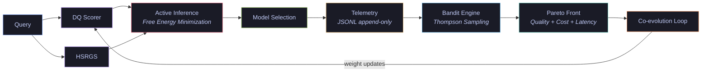

<div align="center">


<br/><br/>

[](https://python.org)
[](https://nodejs.org)
[](LICENSE)
[](#learnable-weight-system)
[](#sprint-timeline)
[](https://arxiv.org/abs/2511.15755)

</div>

---

**meta-vengine** is a self-improving AI routing engine that selects the optimal model for every query using Decision Quality (DQ) scoring, active inference, and a Thompson Sampling bandit that continuously tunes 48 learnable parameters across 9 groups. It learns from every session, tracks a Pareto front across quality/cost/latency, and evolves its own configuration through three autonomous daemons -- no external frameworks, no cloud dependencies, fully sovereign.

---

## Architecture


```mermaid
flowchart LR
    Q["Query"] --> DQ["DQ Scorer"]
    Q --> H["HSRGS"]
    DQ --> AI["Active Inference<br/><i>Free Energy Minimization</i>"]
    H --> AI
    AI --> MS["Model Selection"]
    MS --> T["Telemetry<br/><i>JSONL append-only</i>"]
    T --> B["Bandit Engine<br/><i>Thompson Sampling</i>"]
    B --> P["Pareto Front<br/><i>Quality + Cost + Latency</i>"]
    P --> CE["Co-evolution Loop"]
    CE -->|"weight updates"| DQ

    style Q fill:#1a1b26,stroke:#7aa2f7,color:#c0caf5
    style DQ fill:#1a1b26,stroke:#bb9af7,color:#c0caf5
    style H fill:#1a1b26,stroke:#bb9af7,color:#c0caf5
    style AI fill:#1a1b26,stroke:#f7768e,color:#c0caf5
    style MS fill:#1a1b26,stroke:#9ece6a,color:#c0caf5
    style T fill:#1a1b26,stroke:#e0af68,color:#c0caf5
    style B fill:#1a1b26,stroke:#7dcfff,color:#c0caf5
    style P fill:#1a1b26,stroke:#73daca,color:#c0caf5
    style CE fill:#1a1b26,stroke:#ff9e64,color:#c0caf5
```

## Sprint Timeline

| Sprint | Codename | Stories | Key Deliverables |
|:------:|:---------|:-------:|:-----------------|
| **1** | Graph Signal + SUPERMAX v2 | 12/12 | Multi-feature graph signal (entropy, Gini, subgraph density, IRT), DQ calibration via ECE, behavioral outcome scoring, SUPERMAX v2 with Free-MAD trajectory scoring and disagreement escalation, A/B test framework |
| **2** | **Optimas** | 12/12 | Thompson Sampling bandit engine, 19-param registry, weight safety (drift clamping + rollback), contextual LRF clustering, Bayesian optimization, session-type reward shaping |
| **3** | **Prometheus** | 12/12 | Learning loop activation (`banditEnabled=true`), 3 autonomous daemons (daily snapshot, weekly LRF, monthly BO), learnable reward function, learnable cluster count, per-cluster exploration annealing, co-evolution self-documentation |
| **4** | **Athena** | 12/12 | Observatory dashboard (localhost:8420), active inference for model selection, Pareto front tracking, operator preference vectors, time-of-day scheduling, learnable session multipliers with volume gates, weight evolution charts |

> **48 user stories shipped. 48 learnable parameters. Zero regressions.**

## Key Features

<details>
<summary><b>DQ Scoring</b> -- Multi-dimensional query quality assessment</summary>

<br/>

The DQ Scorer evaluates every incoming query across three calibrated dimensions -- validity, specificity, and correctness -- to produce a composite Decision Quality score. Weights are themselves learnable via the bandit engine. Calibrated through Expected Calibration Error (ECE) analysis against behavioral outcomes.

- `kernel/dq-scorer.js` -- Core scoring engine
- `kernel/dq-calibrator.py` -- ECE computation and weight adjustment
- `kernel/behavioral-outcome.py` -- Composite behavioral signal extractor

</details>

<details>
<summary><b>Active Inference</b> -- Free energy minimization for model selection</summary>

<br/>

Replaces static routing with an active inference loop that minimizes free energy (prediction error + complexity cost) to select models. The system maintains generative models of expected outcomes per provider and updates beliefs after each session.

- `kernel/active-inference.py` -- Free energy minimization engine

</details>

<details>
<summary><b>Thompson Sampling Bandit</b> -- Autonomous weight optimization</summary>

<br/>

A multi-armed bandit with Thompson Sampling explores weight perturbations, measures outcomes via a composite reward function (DQ accuracy 40% + cost efficiency 30% + behavioral signal 30%), and updates Beta-distributed beliefs. Safety: max 5% drift per epoch, 8% reward drop triggers automatic rollback.

- `kernel/bandit-engine.js` -- Thompson Sampling core
- `kernel/param-registry.js` / `kernel/param_registry.py` -- 48-param unified registry
- `kernel/weight-safety.py` -- Drift clamping and rollback logic

</details>

<details>
<summary><b>Pareto Front</b> -- Multi-objective optimization</summary>

<br/>

Tracks the Pareto frontier across quality, cost, and latency. Operator preference vectors bias Bayesian Optimization exploration along the frontier. Time-of-day scheduling shifts preferences automatically (peak hours favor quality, off-peak favors cost).

- `kernel/pareto.py` -- Pareto front tracking and dominance checks
- `kernel/bayesian_optimizer.py` -- Monthly BO cycle with preference-aware acquisition

</details>

<details>
<summary><b>LRF Clustering</b> -- Contextual routing regions</summary>

<br/>

Learnable Routing Function clusters partition the query space into contextual regions, each with independent exploration rates and weight overrides. Cluster count is itself learnable, validated by silhouette score. Sparse clusters explore more; mature clusters exploit.

- `kernel/lrf-clustering.py` -- Contextual LRF with learnable k
- `kernel/lrf-update-daemon.py` -- Weekly cluster re-estimation

</details>

<details>
<summary><b>Observatory Dashboard</b> -- Real-time visibility into the learning loop</summary>

<br/>

Served on `localhost:8420`. Weight evolution charts, LRF cluster visualization, A/B experiment tracking, Pareto front plots, and daemon health monitoring. Pure HTML/JS -- no build step.

- `kernel/dashboard/` -- Dashboard server and static assets
- `scripts/observatory/` -- Metric collectors and analytics agents

</details>

<details>
<summary><b>HSRGS</b> -- Homeomorphic Self-Routing Godel System</summary>

<br/>

Emergent routing via topological pressure fields. Models the provider landscape as a dynamic manifold where query embeddings flow toward optimal attractors. Feeds into the active inference layer as a prior.

- `kernel/hsrgs.py` -- Pressure-field model selection

</details>

<details>
<summary><b>Autonomous Daemons</b> -- Three self-scheduling optimization loops</summary>

<br/>

| Daemon | Schedule | Function |
|--------|----------|----------|
| Weight Snapshot | Daily | Captures parameter state, computes drift metrics |
| LRF Update | Weekly | Re-clusters query space, adjusts exploration rates |
| Bayesian Optimization | Monthly | Full BO cycle over Pareto front with preference vectors |

- `kernel/weight-snapshot-daemon.py`
- `kernel/lrf-update-daemon.py`
- `kernel/bo-monthly-daemon.py`

</details>

## Project Structure

```
meta-vengine/
├── kernel/                    # Core engine
│   ├── dq-scorer.js           # DQ scoring engine
│   ├── bandit-engine.js       # Thompson Sampling bandit
│   ├── param-registry.js      # Learnable parameter registry (JS)
│   ├── param_registry.py      # Learnable parameter registry (Python)
│   ├── active-inference.py    # Free energy minimization
│   ├── pareto.py              # Multi-objective Pareto front
│   ├── hsrgs.py               # Emergent routing
│   ├── lrf-clustering.py      # Contextual LRF clustering
│   ├── weight-safety.py       # Drift clamping + rollback
│   ├── bayesian_optimizer.py  # Monthly BO cycle
│   ├── cognitive-os.py        # Energy-aware routing
│   ├── pattern-detector.js    # 8 session-type classifier
│   ├── dashboard/             # Observatory web UI
│   └── tests/                 # Kernel test suites
├── config/
│   ├── learnable-params.json  # 48 params, single source of truth
│   ├── pricing.json           # Canonical model ID registry
│   └── supermax-v2.json       # SUPERMAX consensus config
├── coordinator/               # Multi-agent orchestration
│   ├── orchestrator.py        # Strategy dispatcher
│   └── strategies/            # parallel_research, implement, review, full
├── daemons/                   # Autonomous optimization loops
├── scripts/
│   ├── observatory/           # Metrics, collectors, analytics
│   └── session-optimizer/     # Session cost optimization
├── proposals/                 # Sprint PRDs
├── data/
│   ├── weight-snapshots/      # Historical weight states
│   └── ab-reports/            # A/B test results
└── docs/                      # Architecture docs, benchmark results
```

## Learnable Weight System

48 parameters across 9 groups, all defined in `config/learnable-params.json`:

| Group | Params | What It Controls |
|:------|:------:|:-----------------|
| Graph Signal | 4 | Entropy, Gini, subgraph density, IRT difficulty weights |
| DQ Weights | 3 | Validity, specificity, correctness balance |
| Agent Thresholds | 5 | Complexity tier boundaries for agent routing |
| Free-MAD | 3 | Stability decay, sycophancy and disagreement thresholds |
| Behavioral | 4 | Completion, tool success, efficiency, override weights |
| Reward Composition | 3 | DQ vs cost vs behavioral reward mix |
| LRF Topology | 1 | Cluster count (learnable k) |
| Exploration Schedule | 1 | Global exploration floor |
| Session Multipliers | 24 | Per-session-type reward shaping (8 types x 3 dimensions) |

## Quick Start

```bash
# Clone
git clone https://github.com/Dicoangelo/meta-vengine.git
cd meta-vengine

# Run preflight checks
python3 kernel/preflight.py

# Run the test suite
pytest kernel/tests/

# Start the observatory dashboard
python3 kernel/dashboard/server.py
# Open http://localhost:8420

# Route a query
source init.sh
uni-ai "your query here"

# View the routing dashboard
routing-dash
```

## Testing

```bash
# Full kernel test suite
pytest kernel/tests/

# Individual test modules
pytest kernel/tests/test_learning_loop.py        # Bandit + safety + LRF integration
pytest kernel/test_bayesian_optimizer.py          # Bayesian optimization
pytest kernel/test_lrf_clustering.py              # LRF clustering
pytest kernel/test_weight_safety.py               # Drift clamping + rollback
pytest kernel/test_param_registry.py              # Parameter registry

# JavaScript tests
node kernel/bandit-engine.test.js                 # Bandit engine
node kernel/dq-scorer.test.js                     # DQ scorer
node kernel/param-registry.test.js                # Param registry

# Observatory QA
pytest scripts/observatory/qa-test-suite.py

# A/B test analysis
python3 scripts/ab-test-analyzer.py --detailed
```

## Design Principles

1. **Bidirectional co-evolution** -- The system reads its own patterns and modifies its own configuration. Every BO cycle writes updated weight state back into project documentation.

2. **Sovereignty by design** -- All data stays local. SQLite + JSONL. No cloud telemetry. Human approval gates for configuration changes above safety thresholds.

3. **Zero dependencies** -- Vanilla JavaScript + Python standard library. No npm packages, no pip requirements. If the standard library can do it, the standard library does it.

4. **Append-only telemetry** -- JSONL logs are never overwritten, only appended. Every weight snapshot, every routing decision, every daemon outcome is preserved for retrospective analysis.

5. **Model ID sovereignty** -- `config/pricing.json` is the canonical model ID registry. No inline model strings anywhere in the codebase. When a model 404s, one file gets updated and every consumer inherits the fix.

## Paper

This engine implements and extends the DQ Scoring framework from:

> **Decision Quality Scoring for AI Model Routing**
> arXiv:2511.15755
>
> 100-query benchmark. 8/8 evaluation criteria passed.
> SUPERMAX consensus: **+12.4% DQ improvement**, **-95.4% variance** vs single-model baseline.

Full benchmark results: [`docs/DQ_BENCHMARK_RESULTS.md`](docs/DQ_BENCHMARK_RESULTS.md)

---

<div align="center">

[](https://github.com/Dicoangelo)

</div>


